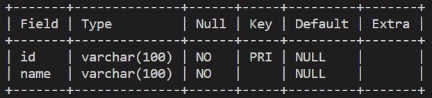
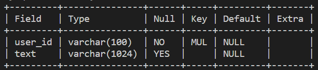
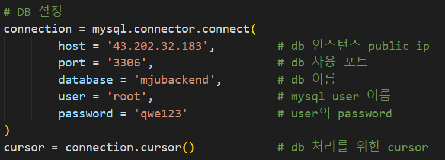
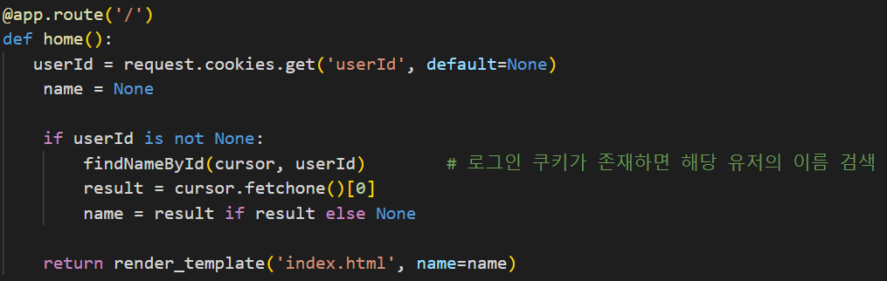
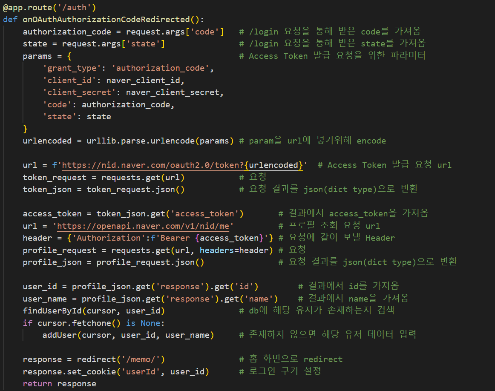
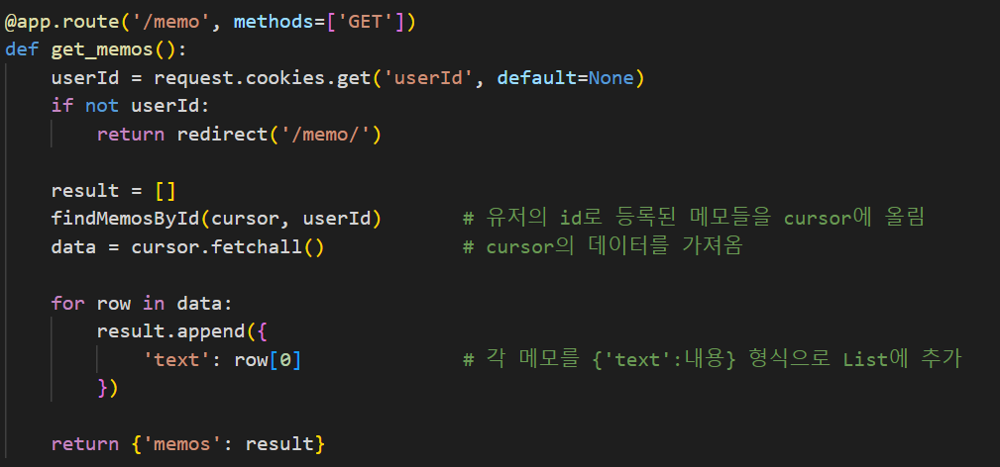
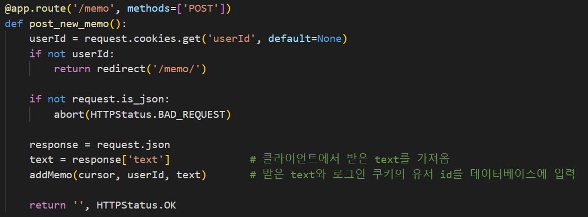

# 실행 방법

1. http://60212192-lb-1288466503.ap-northeast-2.elb.amazonaws.com/memo 접속
2. 네이버 로그인 진행
3. 로그인 성공 시 메모 작성

# 데이터베이스 구조

user table

memo table

# 코드 설명

## 데이터 베이스 연결

mysql-connector-python 모듈을 사용하여 mysql 데이터베이스에 연결

    pip install mysql-connector-python

+ host: EC2 60212192-db 인스턴스의 public ip
+ port: 데이터베이스에 접근하기 위한 port 해당 프로젝트는 mysql 기본 포트인 3306을 사용했다.
+ database: 해당 프로젝트에서 사용할 데이터베이스의 이름
+ user: 데이터베이스에 접근할 user
+ password: 위의 uesr에 대한 인증을 진행할 password 

## def home()

메모장 프로젝트의 홈 화면을 요청받고 사용자의 로그인 쿠키가 있을 경우 해당 유저의 이름과 메모가 담긴 화면(index.html)을 반환하는 함수

## def login()

네이버 로그인 버튼 클릭시 호출되는 함수 네이버 로그인 요청 API를 호출하게 된다.

## def onOAuthAuthorizationCodeRedirected()

네이버 로그인 API 설정할 때 설정한 redirect uri를 통해 호출되는 함수 로그인 요청 API의 결과로 받은 code 및 state를 통해 Accesstoken 발급 후 해당 Token을 통해 유저의 네이버 프로필을 불러오게 된다. 이 떄 데이터베이스에 해당 유저의 데이터가 존재하지 않으면 데이터베이스에 해당 유저를 등록한 뒤에 로그인 쿠키를 설정하고 홈 화면으로 redirect한다.

## def get_memos()

로그인 쿠키에 있는 유저에 대한 메모 리스트를 불러온다. findMemosById()를 통해 데이터베이스에 접근하여 유저의 메모들을 불러오고 result List를 반환한다.

## def post_new_memo()

로그인 쿠키에 있는 유저의 메모를 추가한다. 입력받은 text를 addMemo()를 통해 데이터베이스에 작성하고 커밋한다. 성공시 200 status code를 반환한다.

## def health_check()

AWS 대상 그룹 인스턴스의 health check를 위해 작성한 코드이다. 호출 성공시 200 status code를 반환한다.

## def findMemosById(cursor, id)

cursor와 id를 받아 데이터베이스의 memo table에 접근하여 데이터베이스의 user_id와 입력받은 id가 일치하는 text들을 cursor에 올린다.

    query : SELECT text FROM memo WHERE user_id={id}

## def findNameById(cursor, id)

데이터베이스의 user table에 접근하여 데이터베이스의 id와 입력받은 id가 일치하는 유저의 name을 cursor에 올린다.

    query : SELECT name FROM user WHERE id={id}

## findUserById(cursor, id)

데이터베이스의 user table에 접근하여 데이터베이스의 id와 입력받은 id가 일치하는 유저의 데이터를 cursor에 올린다.

    query : SELECT * FROM user WHERE id={id}

## addUser(cursor, id, name)

데이터베이스의 user table에 로그인시 받은 id와 name을 작성하고 데이터베이스에 commit한다.

    query : INSERT INTO user (id, name) VALUES ({id}, {name})

## addMemo(cursor, id, text)

데이터베이스의 memo table에 입력받은 text와 작성한 유저의 id를 작성하고 데이터베이스에 commit 한다.

    query : INSERT INTO memo (user_id, text) VALUES ({id}, {text})